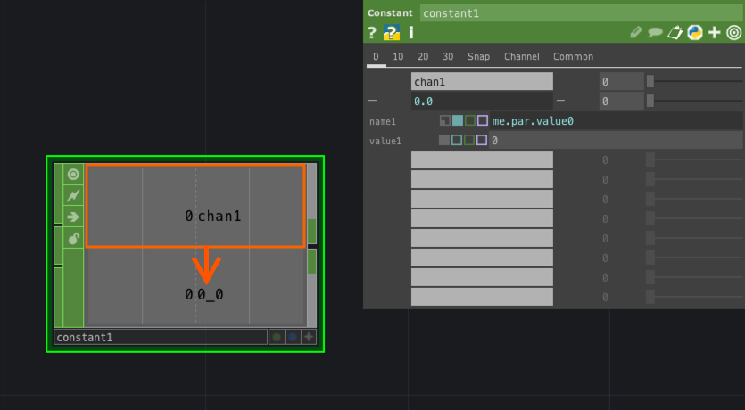

# Referance


パラメータの値の参照方法

### コピーによる参照方法

1.参照元のパラメータ上で`Copy Parameter`

2.参照先のパラメータ上で`Paste Reference`

&nbsp;
&nbsp;

### ソースによる参照方法


同じパネルの値を参照したい場合




```
me.par.value0
```

&nbsp;

違うパネルの値を参照したい場合


```
op('constant1').par.value0	
```

&nbsp;
&nbsp;

## Expression


| Expression  |b  |
|---|---|---|
|absTime.frame  |現在のフレーム番号を取得  |
|absTime.seconds |経過時間を取得  |
|me.digits | opの番号を取得（constant1の場合は1）|
|me.inputVal | 入力値を取得する |
|op('name').par[0] or op('name').par.parname|オペレーターのパラメーターを取得 |