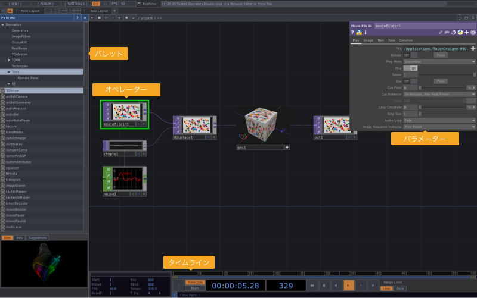
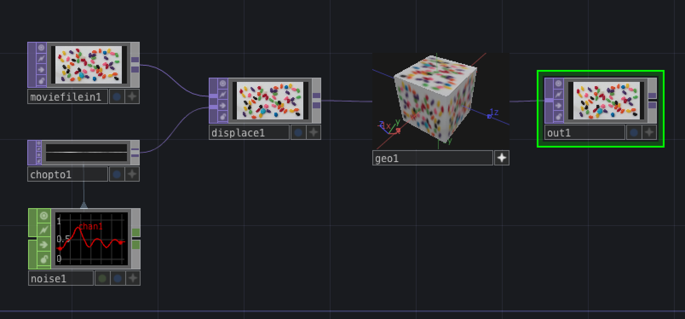
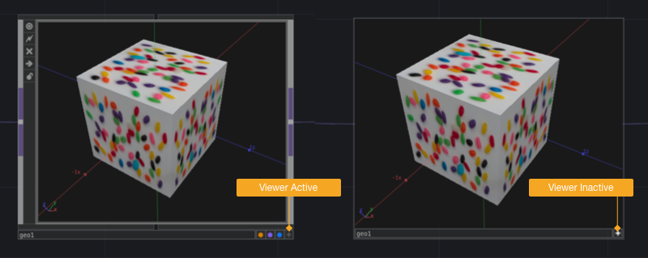

# TouchDesigner基礎

---

&nbsp;
&nbsp;

## TouchDesignerについて
DERIVATIVE社からリリースされているリアルタイム・ビジュアル・プログラミングツール。機能を持ったオペレーターと呼ばれるノードを繋いでいきながら作品を作る。

&nbsp;
&nbsp;

## TouchDesigner 操作画面

&nbsp;
&nbsp;

## TouchDesigner 操作方法
* ダブルクリックもしくはタブで `OP Create Dialog`
* スクロールで拡大縮小
* ドラッグで画面移動
* 右クリック+ドラッグで複数選択
* 右クリック+ `View`  ウインドウで表示
* `F1` ウインドウで表示

&nbsp;
&nbsp;

## ショートカット

* `U` 階層上がる
* `I` 階層に入る
* `H` 一覧
* `P` パラメーター表示/非表示
* `A` オペレーター上で `Viewer Active`

&nbsp;
&nbsp;

## Operatorについて

さまざまな機能を持ったOperator(オペレーター)をワイヤーで繋いでNetworksを作成していく。Operatorは左から右へとデータが流れていく。

&nbsp;
&nbsp;

### Operatorの種類

&nbsp;

#### [COMP - Components](https://docs.derivative.ca/Component)
プログラミングを構築する部品

&nbsp;

#### [TOP - Texture Operators](https://docs.derivative.ca/TOP)
2D画像処理を行うOperator

&nbsp;

#### [CHOP - Channel Operators](https://docs.derivative.ca/CHOP)
数値処理を行うオペレータ

&nbsp;

#### [SOP - Surface Operators](https://docs.derivative.ca/SOP)
3Dオブジェクトを扱うOperator

&nbsp;

#### [DAT - Data OPerators](https://docs.derivative.ca/DAT)
データを扱うOperator

&nbsp;

#### [MAT - Material Operators](https://docs.derivative.ca/MAT)
3Dオブジェクトの表面を扱うOperator

&nbsp;
&nbsp;

## Operator操作

右下の「+」ボタンでビューアーがアクティブ化する

---