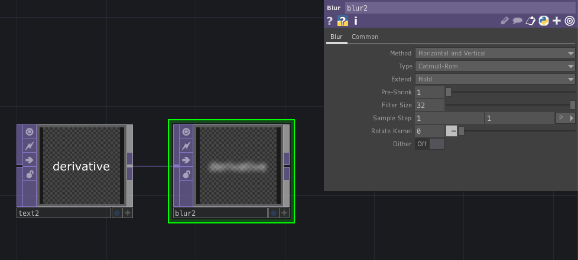

# TOP (Texture Operator)

2D画像処理を行うオペレータ

---

&nbsp;
&nbsp;

## 公式リファレンス
[TOP - Texture Operators](https://docs.derivative.ca/TOP)

&nbsp;
&nbsp;

## Rectangle
矩形

&nbsp;
&nbsp;

## Circle
円形

&nbsp;
&nbsp;

## Transform

 * Translate XY座標移動
 * Rotate 回転　
 	* `absTime.frame` 時間に合わせて回転
 * Scale 拡大縮小
 * Pivot 回転軸　0.5/0.5で中央座標になる 
 * Background Color 
 	* `Alpha`を1にすると背景が塗られる

&nbsp;
&nbsp;

## Movie File In

動画/画像の読み込み

### Play
- Play Mode 
  - Sequential タイムラインに連動しない
  - Lock to Timeline タイムラインと連動する
- Speed 再生速度
- Cue CuePointから再生し直す
- Cue Point 途中から再生

### Trim
- Extend Right
  - Hold 1回で止まる
  - Cycleループ

&nbsp;
&nbsp;

## Level

レベル補正。イメージのコントラスト、明るさ、ガンマを調整する

&nbsp;
&nbsp;

## Blur

ぼかし
 

* Filter Size ぼかし量

&nbsp;
&nbsp;

## Switch

切り替える

&nbsp;
&nbsp;

## Crop
切り取り

&nbsp;
&nbsp;

## HSV Adjust
HSBカラー
  - Hue Offset 色相

&nbsp;
&nbsp;

## Video Device in
Webカメラ

&nbsp;
&nbsp;

## Flip
反転

&nbsp;
&nbsp;

## Edge
輪郭線

&nbsp;
&nbsp;

## Constant

単色を塗る

&nbsp;
&nbsp;

## Ramp

グラデーションを生成する

&nbsp;
&nbsp;

## Add

加算

&nbsp;
&nbsp;

## Multiply

乗算

&nbsp;
&nbsp;

## Composit
合成オペレーション

  - インプットが複数できる
  - http://ted-kanakubo.com/touchdesigner-jp/?p=230
  - Operation 合成の種類を選ぶ
  - Transform 合成のサイズを調整する
    
&nbsp;
&nbsp;

## Over

単純に重ねる

  - http://ted-kanakubo.com/touchdesigner-jp/?p=202
  - Transformでどちらに合わせるか
  - 

## Under
下に

&nbsp;
&nbsp;

## Math 

複数のOPの値を計算する
- Range マッピングする

&nbsp;
&nbsp;

## luma Blur

グラデーション型のぼかし

&nbsp;
&nbsp;

## Displace
画像を歪める

&nbsp;
&nbsp;

## Feedback
フィードバック・エフェクト(軌跡)を作成する

`Target TOP`にフィードバックループの対象となるOPを指定する

&nbsp;
&nbsp;

## Tile
反復するパターン

&nbsp;
&nbsp;

## Channel Mix

RGBAチャンネルを混合

### 透過を作成

&nbsp;
&nbsp;

## Cross

クロスフェード

&nbsp;
&nbsp;

## Noise

ノイズを生成する

&nbsp;
&nbsp;

## Null
最終型
  - 右クリック > view ウインドウを固定

&nbsp;
&nbsp;

## Out

外部出力する

&nbsp;
&nbsp;