# CHOP (Channel Operator)

数値処理を行うオペレータ

---


&nbsp;
&nbsp;

## 公式リファレンス
[CHOP - Channel Operators](https://docs.derivative.ca/CHOP)


&nbsp;
&nbsp;


## Constant

変数、数値の保存。デフォルトでは名前が「chan1」となり0-1の間で保存ができる。
スライダに直接入力すると値をあげられることができる。1つのオペレーターに40個保存することができる。

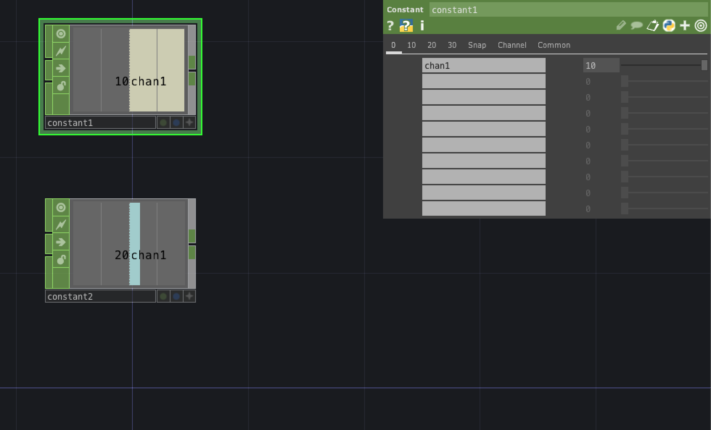


&nbsp;
&nbsp;

## Math

### OP
- `Combile Channels` `Combile CHOPs`から四則演算

### Mult-Add

- `Multiply`で数値を掛け算

### Range

- `From Range`の値を`To Range`にマッピングする


&nbsp;
&nbsp;


## Noise
-1から1の間で自然な乱数を生成する。

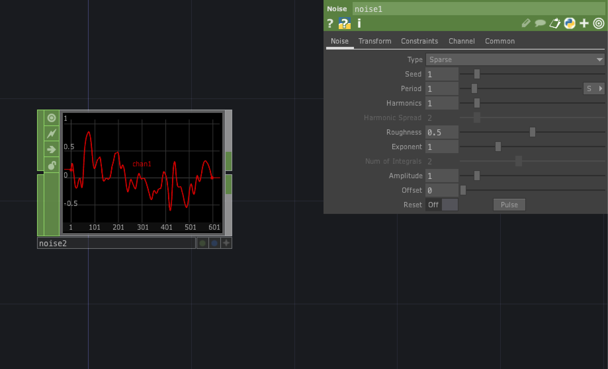

`Time Slise`を`On`にすると連続で値を返す

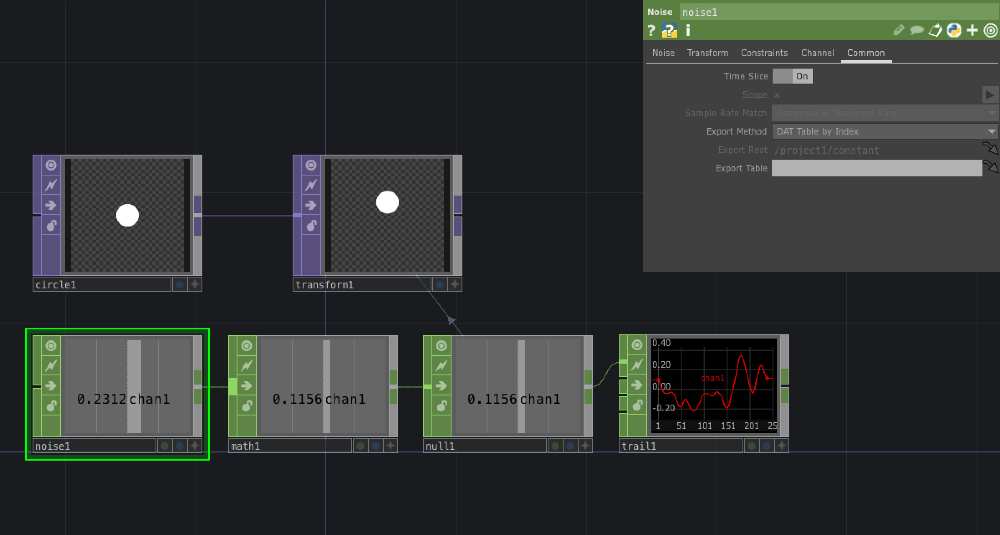


&nbsp;
&nbsp;

## Filter

数値の変動をフィルタリングする。スムースあるいはシャープに

&nbsp;
&nbsp;

## Lag

時間を設定して数値が変動する。初速終速を調整できる。

&nbsp;
&nbsp;

## Limit

入力値に最大・最小の制限をつける

&nbsp;
&nbsp;


## Speed

時間内に数値が変化する
第1入力に値が送られると毎秒1カウントづつ増加します。

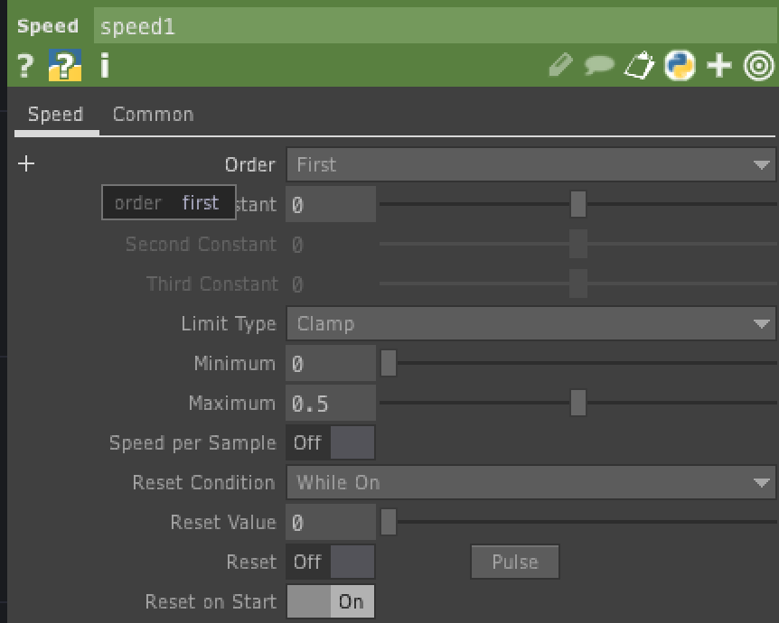

&nbsp;

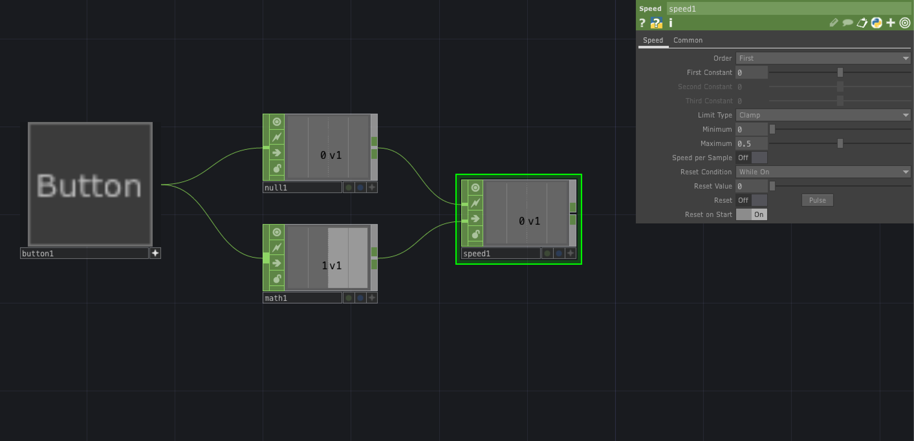

第2入力に0が送られるとリセットする


&nbsp;
&nbsp;

## LFO 

周波数を生成する


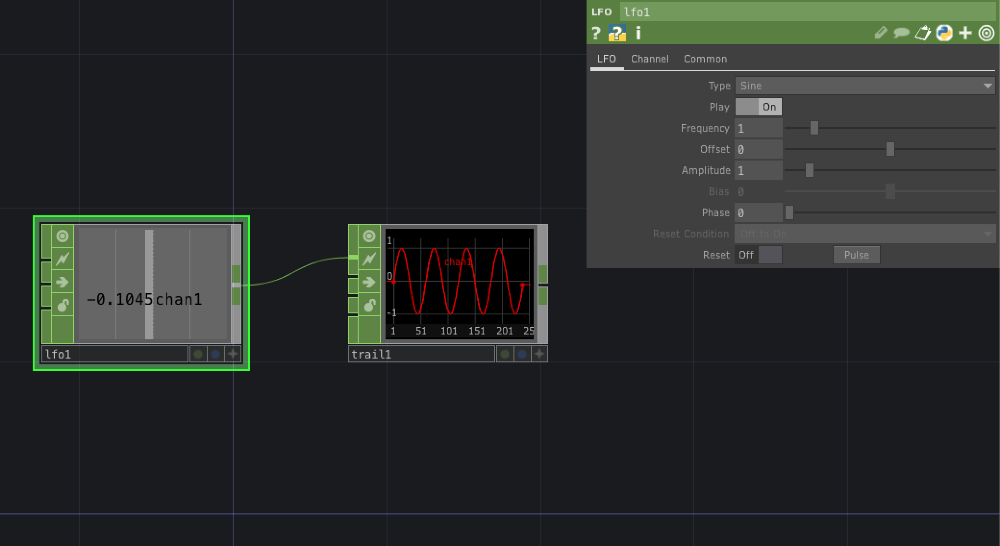

* `Type` 周波数の形

| LFO Type  | 説明  |
|---|---|---|
| Sin | サイン波　-1 から 1の繰り返し |
| Gaussian |  0-1-0の繰り返し | 
| Triangle | 三角波　-1 から 1の繰り返し |
| Ramp | 0-1 の繰り返し| 
| Square | 矩形波　-1 から 1の繰り返し |
| Pulse | 点滅　-1 から 1の繰り返し |

* `Frequency` 周期
* `Amplitude` 振幅

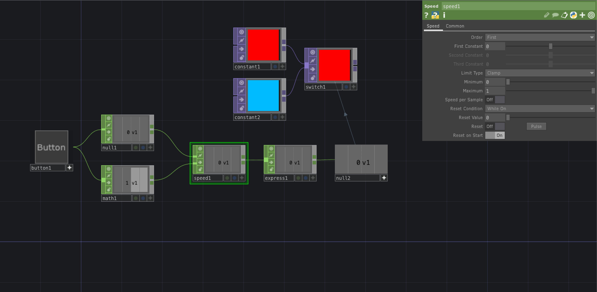


&nbsp;
&nbsp;


## Expression 


条件を分岐するオペレーター


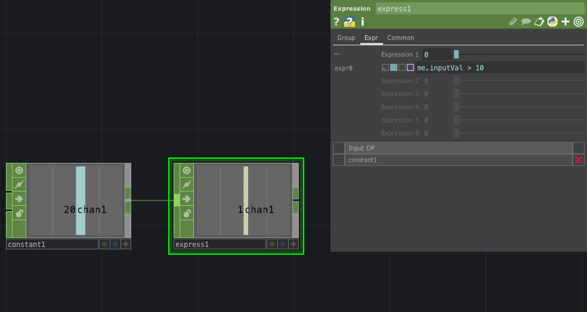

```
//10以上になったら1を返す
me.inputVal > 10

```

&nbsp;

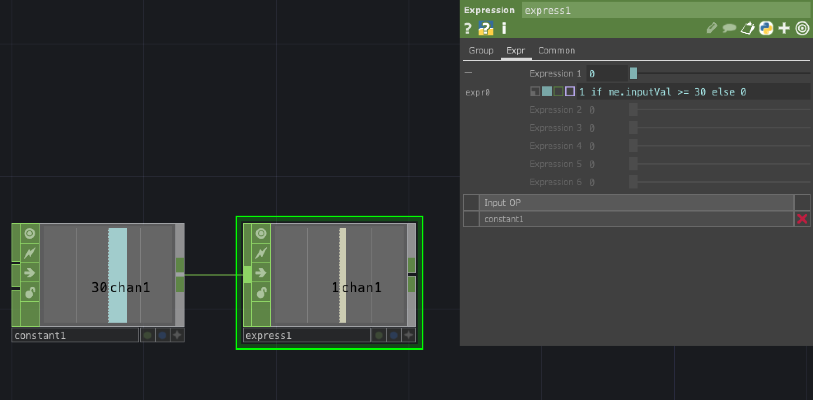

```
//30以上の場合は値が1、そうじゃない場合は0
1 if me.inputVal >= 30 else 0

```


&nbsp;

| Expression  |  |
|---|---|
|absTime.frame  |現在のフレーム番号を取得  |
|absTime.seconds |経過時間を取得  |
|me.digits | opの番号を取得（constant1の場合は1）|
|me.inputVal | 入力値を取得する |
|op('name').par[0] もしくは op('name').par.parname|オペレーターのパラメーターを取得 |


&nbsp;
&nbsp;

## Trail

数値を視覚的グラフで表す

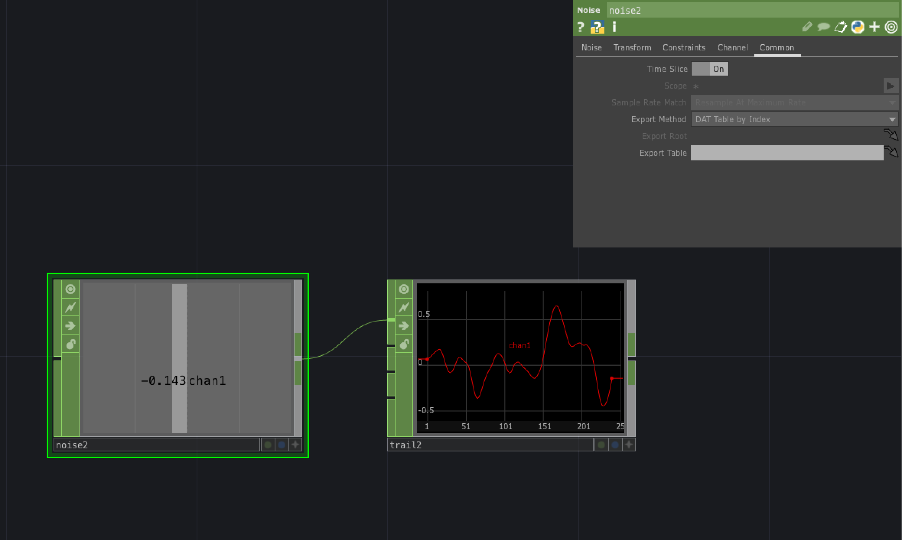


&nbsp;
&nbsp;

## Slope

入力値を微分する

&nbsp;
&nbsp;

## Logic

入力値を論理演算する

&nbsp;
&nbsp;


## Trigger

入力値に対して指定したしきい値`Trigger Threshold`を超えた場合1を返す

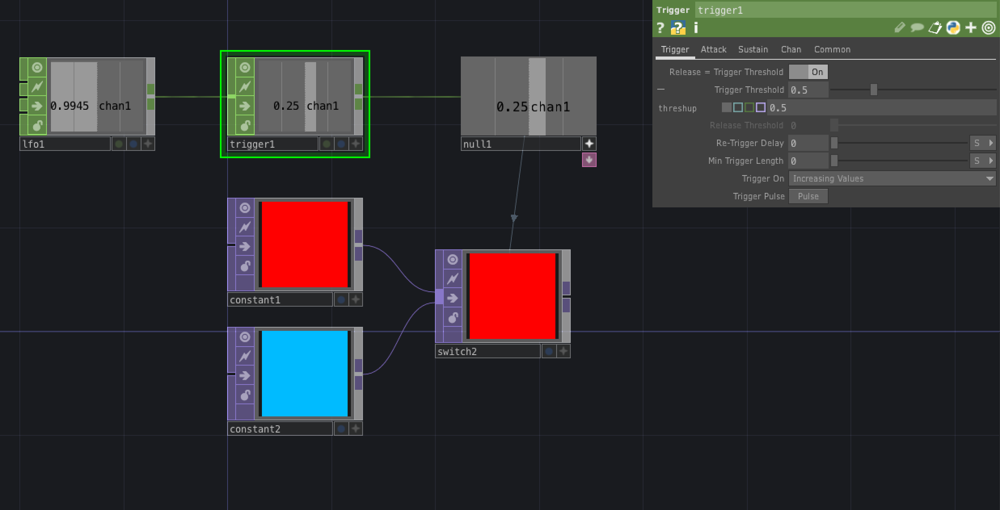

&nbsp;
&nbsp;


## Count

数値を増減していく


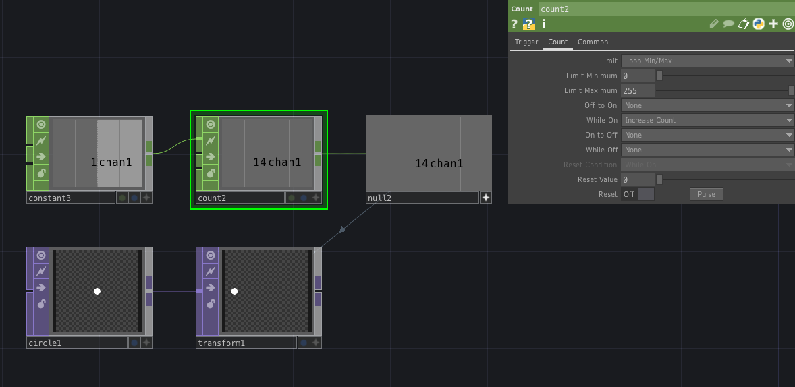


* Limit で最小値と最大値を設定

&nbsp;
&nbsp;


## Audio Device In
- Trail 数値の推移を視覚
- Null 
  - 最後に付ける
  - 値をExportする
- Switch 分岐
- Expression 条件分岐 if文が書ける

- Login
- Mouse In 
  - Select チャンネルを任意で絞る
- Lag　数値の変化を滑らかに

&nbsp;
&nbsp;

## Audio Spectrum
FFT周波数分析をする

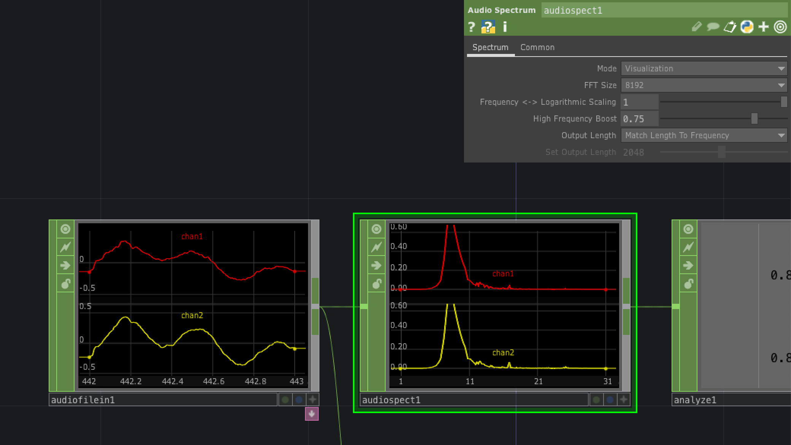


&nbsp;
&nbsp;


## Select

チャンネルを絞る

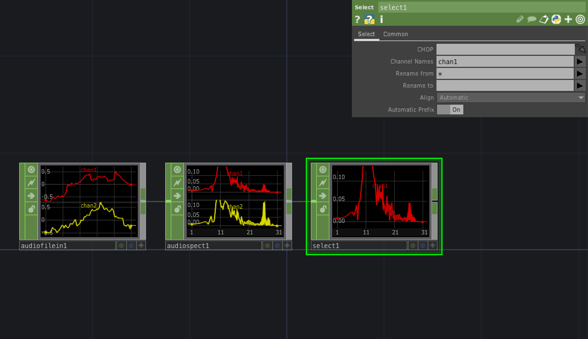

&nbsp;
&nbsp;
