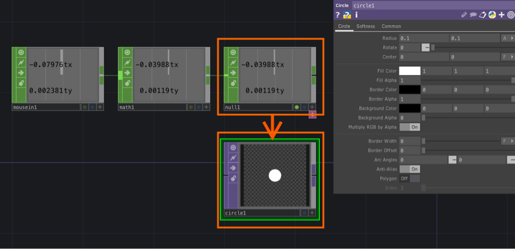
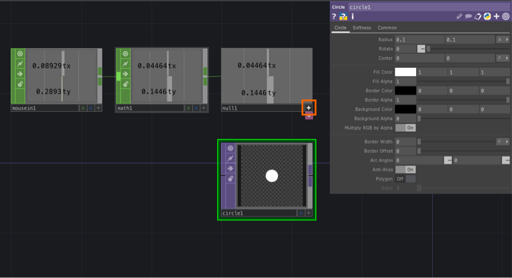
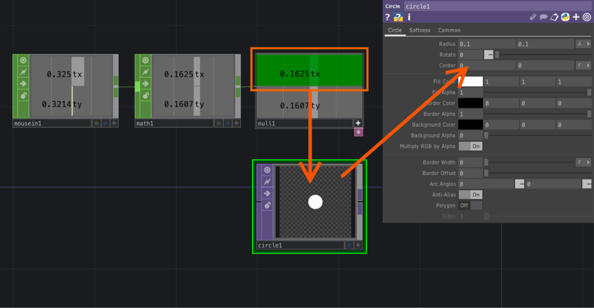

# Expression


パラメータの値の参照方法

## コピーによる参照方法

1.参照元のパラメータ上で`Copy Parameter`

2.参照先のパラメータ上で`Paste Reference`

&nbsp;
&nbsp;

## ソースによる参照方法


同じパネルの値を参照したい場合


```
me.par.value0
```

&nbsp;

違うパネルの値を参照したい場合


```
op('constant1').par.value0	
```

&nbsp;
&nbsp;


## 異なるOP間のデータリンク

1 MouseIn_CHOPから出力される値をCircle_TOPで参照する



&nbsp;

2 出力先のNull1_CHOPをアクティブモードに変更



&nbsp;

3 出力先の Null1_CHOP から Circle_TOP の`centerx`にドラッグ



&nbsp;

4 マウスを離して`Export CHOP`　か `CHOP Reference` を選択 


* `Export CHOP` は固定値
* `CHOP Reference` はphytonで演算が可能。こちらを推奨

&nbsp;

5 データリンクが生成、Null1_CHOPの値が反映される


```
op('null1')['tx']
```


&nbsp;
&nbsp;

## Expression一覧


| Expression  | 内容  |
|:---|:---|
|absTime.frame  |現在のフレーム番号を取得  |
|absTime.seconds |経過時間を取得  |
|me.digits | opの番号を取得（constant1の場合は1）|
|me.inputVal | 入力値を取得する |
|op('name').par[0] もしくは op('name').par.parname|オペレーターのパラメーターを取得 |


&nbsp;
&nbsp;


<!--
## 座標移動

`Circle TOP`の中心座標を移動

```
op('circle1').par.centerx = -0.5
```	

&nbsp;


`Circle TOP`の中心座標を`Constant CHOP`の値*2に移動

```
op('circle1').par.centerx = op('constant1')['chan1'] * 2
```

&nbsp;

`Circle TOP`の中心座標を`Constant CHOP`の値*2に移動

```
op('circle1').par.centerx = op('constant1')['chan1'] * 2
```

&nbsp;

`Circle TOP`の中心座標をランダム値に移動

```
import random
op('circle1').par.centerx = random.random()
```
-->

&nbsp;
&nbsp;

---

## 参考

[基礎編CHOP Exportをする際に開くダイアログ](https://qiita.com/roundjam/items/05088c4767fd3b4cff80)