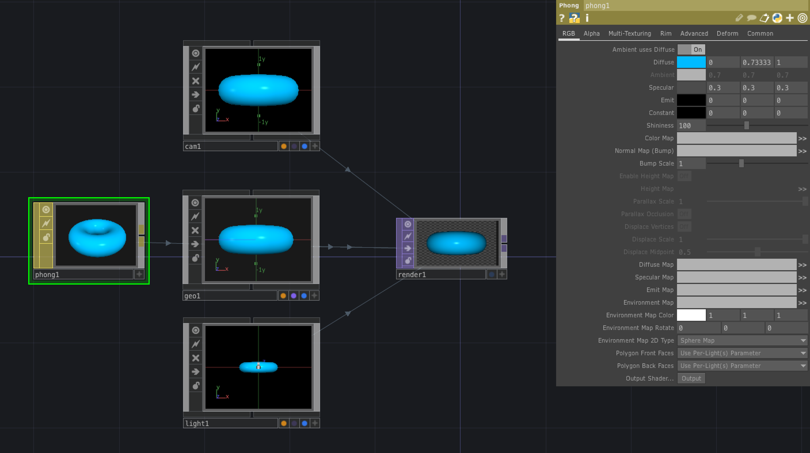

# MAT (Material)

3Dオブジェクトの表面

---

&nbsp;
&nbsp;

## 公式リファレンス
[MAT - Material Operators](https://docs.derivative.ca/MAT)

&nbsp;
&nbsp;

## Phong

フォンシェーディングモデルのマッピング

### マッピング
`Moviefilein`からドラッグでマッピングされる

* Color Map 
* Environment Map 環境マップ

&nbsp;
&nbsp;

## PBR 

物理ベースのテクスチャをマッピング