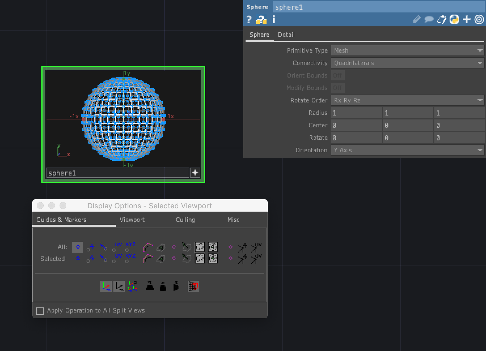
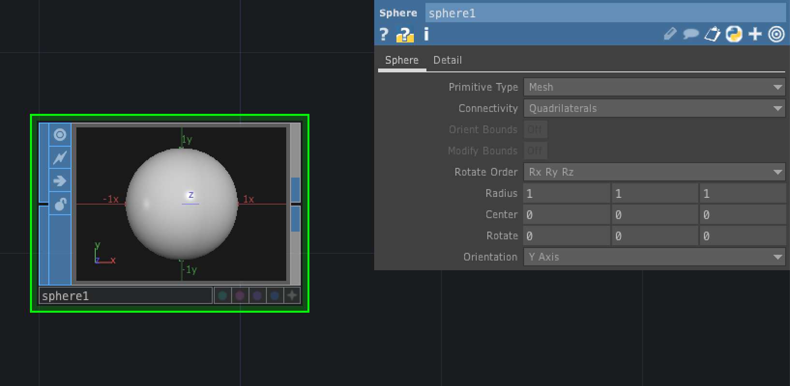
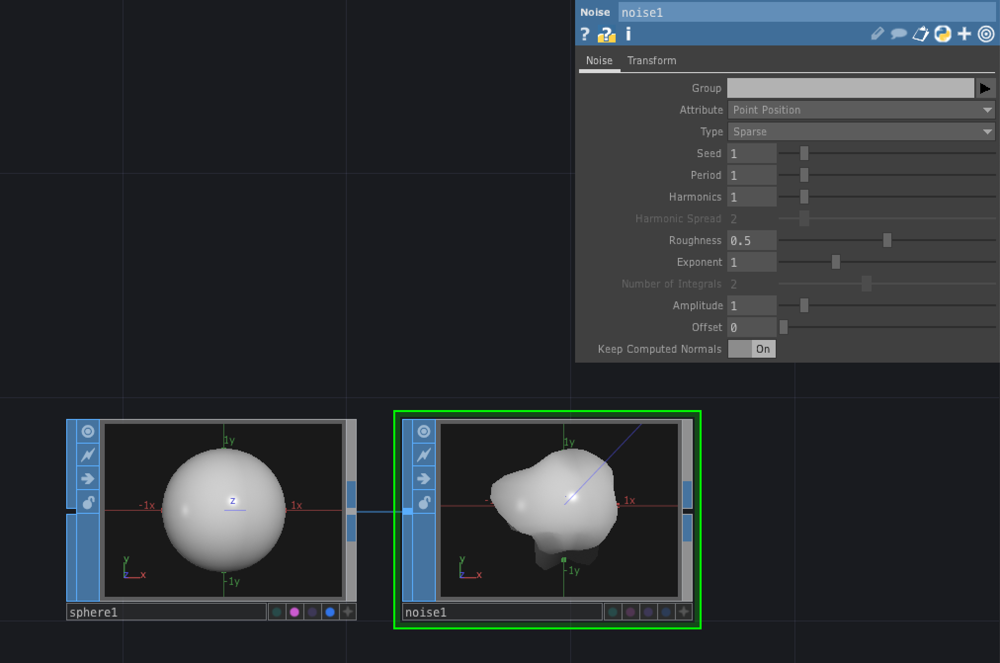

# SOP (Surface Operator)

3Dオブジェクトを扱うオペレータ

&nbsp;
&nbsp;

## 公式リファレンス
[SOP - Surface Operators](https://docs.derivative.ca/SOP)

&nbsp;
&nbsp;

---

# SOP 基本操作

* [+] で`ViewActive`
* [W]でワイヤーフレーム

#### Display Option
右クリックで`Display Option` もしくは [P]

&nbsp;
&nbsp;

---

# 0P

## Add

### Points
* `Delete Geometry, Keep Point` を `On` にすると頂点のみの表示になる

&nbsp;
&nbsp;

## Blend

&nbsp;
&nbsp;

- Carve トリミング
- Copy　複製
  - Translate で座標をずらす
- Merge 描画をまとめる
- Grid

&nbsp;
&nbsp;

## Facet

切子面

- Unique Points　共有
- Compute Nomals 反射

&nbsp;
&nbsp;

## Sphere
球体

### Parameter
#### Sphere Primitive Type

&nbsp;
&nbsp;

## Noise

ノイズ

### Transform

 * TranslateZに`absTime.seconds`を入れると秒数に合わせて頂点がアニメーション

&nbsp;
&nbsp;

## Merge SOP

複数のジオメトリの結合

&nbsp;
&nbsp;

## Transform SOP

座標やスーケル・回転を調整

&nbsp;
&nbsp;
