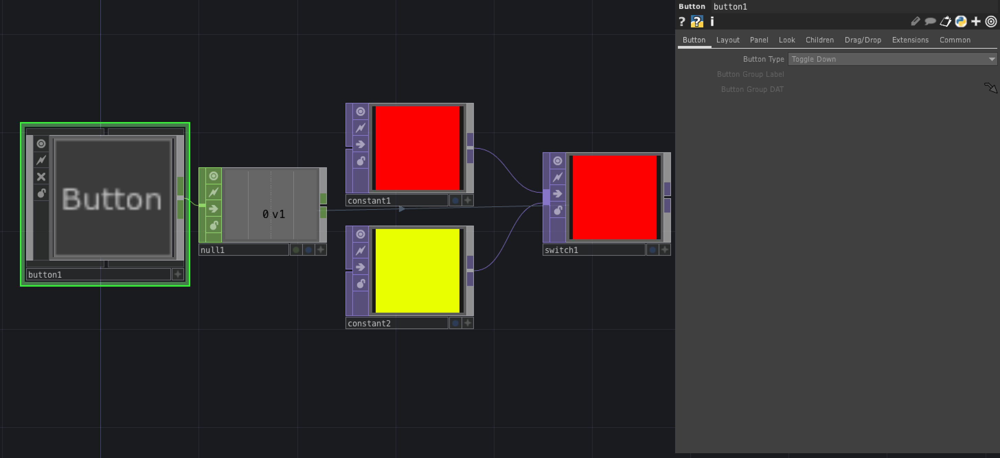
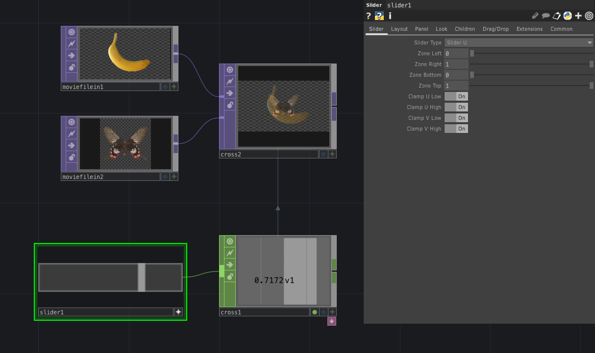

# COMP (Component)

プログラミングを構築する部品

---

&nbsp;
&nbsp;

## 公式リファレンス
[COMP - Components](https://docs.derivative.ca/Component)

&nbsp;
&nbsp;

## Container

モジュールを格納する

&nbsp;
&nbsp;

## Button
ボタン

#### Button Type
	- `Toggle Down` On/Off切り替え
	- `Momentary` 押しているときだけ On

&nbsp;
&nbsp;

## Slider
スライダー

&nbsp;
&nbsp;

## Geometory

SOPの3Dオブジェクトを格納する

&nbsp;
&nbsp;

## Light

3Dオブジェクト用のライト

&nbsp;
&nbsp;

## Camera

3Dオブジェクト用のカメラ

&nbsp;
&nbsp;

