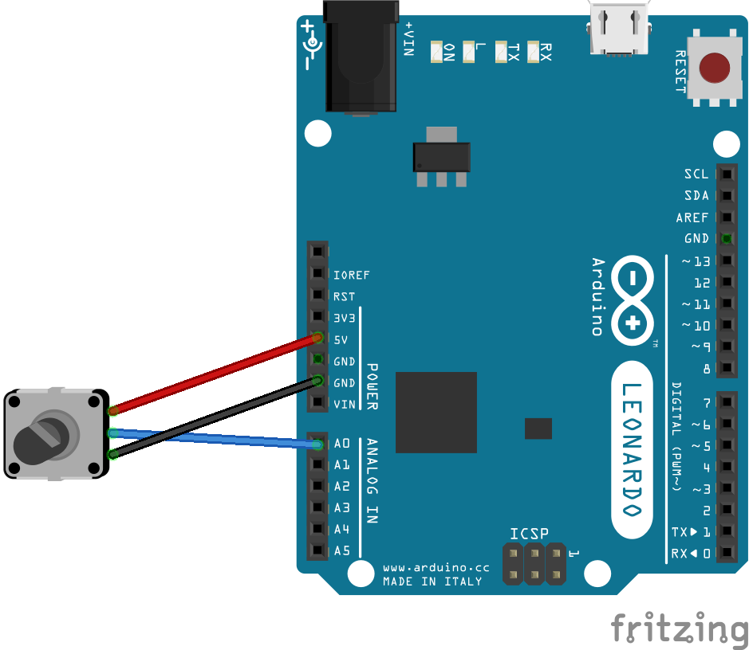
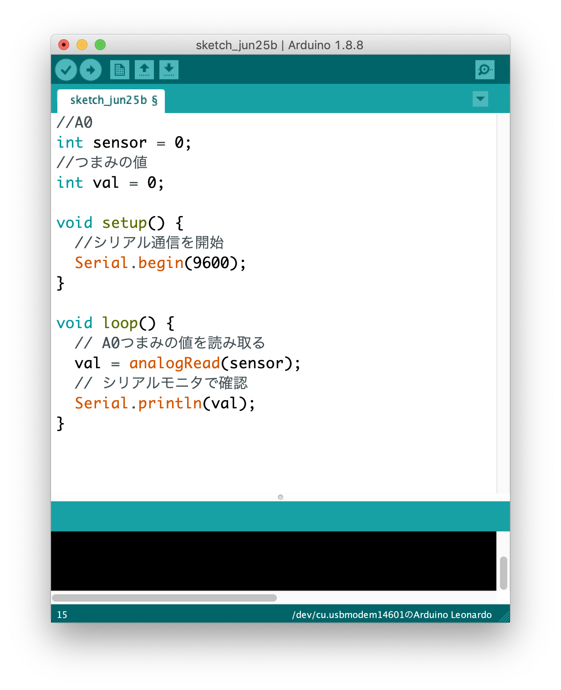
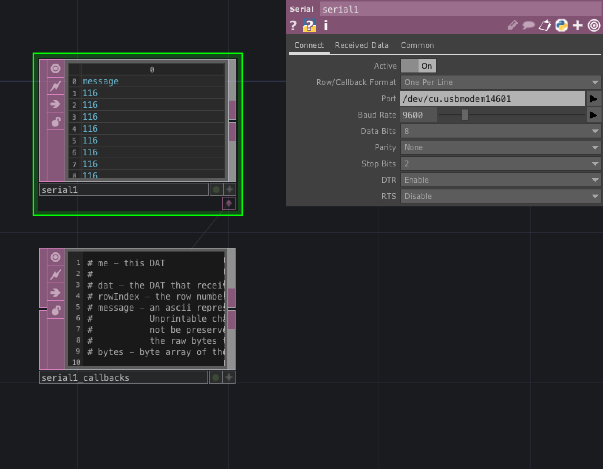
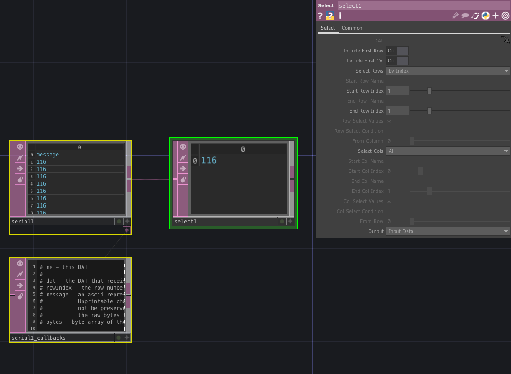
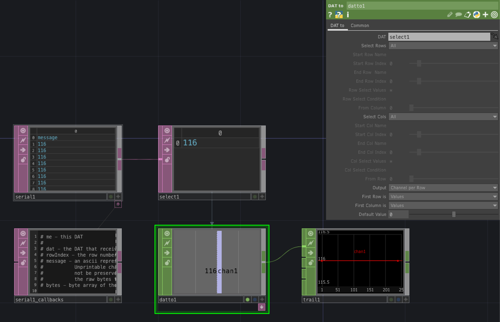

# DAT (Data)

データベースや外部デバイスとの連携を行うオペレータ

---

&nbsp;
&nbsp;

## 公式リファレンス
[DAT - Data Operators](https://docs.derivative.ca/DAT)


&nbsp;
&nbsp;

---

# OP


## Text

テキストデータ

#### Pythonスクリプトの実行

Pythonの実行は右クリックで`Run Script` 

ショートカット`Cmd` + `R`

```
print( op('constant1').par.value0 )
```

&nbsp;
&nbsp;


## Table
行列のテーブル


外部テキストで表組みを組む場合には`Tab`区切りでセルが生成される

&nbsp;
&nbsp;


## Evaluate


&nbsp;
&nbsp;

## Execute


```

def onStart():
	return

def onCreate():
	return

def onExit():
	return

# 
def onFrameStart(frame):
	return

def onFrameEnd(frame):
	return

def onPlayStateChange(state):
	return

def onDeviceChange():
	return

def onProjectPreSave():
	return

def onProjectPostSave():
	return

	

```


&nbsp;
&nbsp;


## Serial

シリアル通信


### Arduino と　TouchDesignerの連携

#### Arduino




```
//A0
int sensor = 0;
//つまみの値
int val = 0;

void setup() {
  //シリアル通信を開始
  Serial.begin(9600);
}

void loop() {
  // A0つまみの値を読み取る
  val = analogRead(sensor);
  // シリアルモニタで確認
  Serial.println(val);
}
```

&nbsp;

#### TouchDesigner

##### 1 `Port` を指定する



&nbsp;


##### 2 Select DATで1行分取得



* Select Cols：by Index
* Start Row Index：1
* End Row Index：1

&nbsp;

##### 3 DAT to CHOPで値を取得



* DAT：`select1`
* First Column is：`Values`
