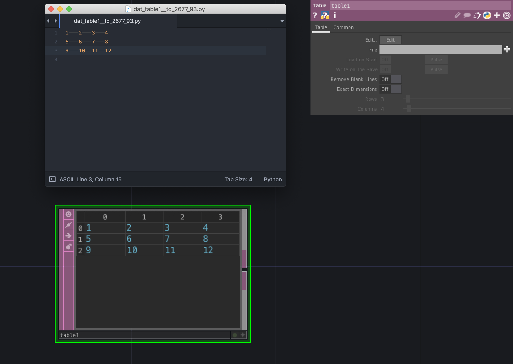

# DAT (Data)

データベースや外部デバイスとの連携を行うオペレータ

---

&nbsp;
&nbsp;

## 公式リファレンス
[DAT - Data Operators](https://docs.derivative.ca/DAT)


&nbsp;
&nbsp;


## text

テキストデータ

#### Pythonスクリプトの実行

Pythonの実行は右クリックで`Run Script` 

ショートカット`Cmd` + `R`

```
print( op('constant1').par.value0 )
```

&nbsp;
&nbsp;


## table
行列のテーブル



外部テキストで表組みを組む場合には`Tab`区切りでセルが生成される

&nbsp;
&nbsp;


### absTime.seconds
TouchDesignerが起動してからの経過時間


## 座標移動

`Circle TOP`の中心座標を移動

	op('circle1').par.centerx = -0.5
	
&nbsp;

`Circle TOP`の中心座標を`Constant CHOP`の値*2に移動

	op('circle1').par.centerx = op('constant1')['chan1'] * 2


&nbsp;

`Circle TOP`の中心座標を`Constant CHOP`の値*2に移動

	op('circle1').par.centerx = op('constant1')['chan1'] * 2
	
&nbsp;

`Circle TOP`の中心座標をランダム値に移動
	
	import random
	op('circle1').par.centerx = random.random()