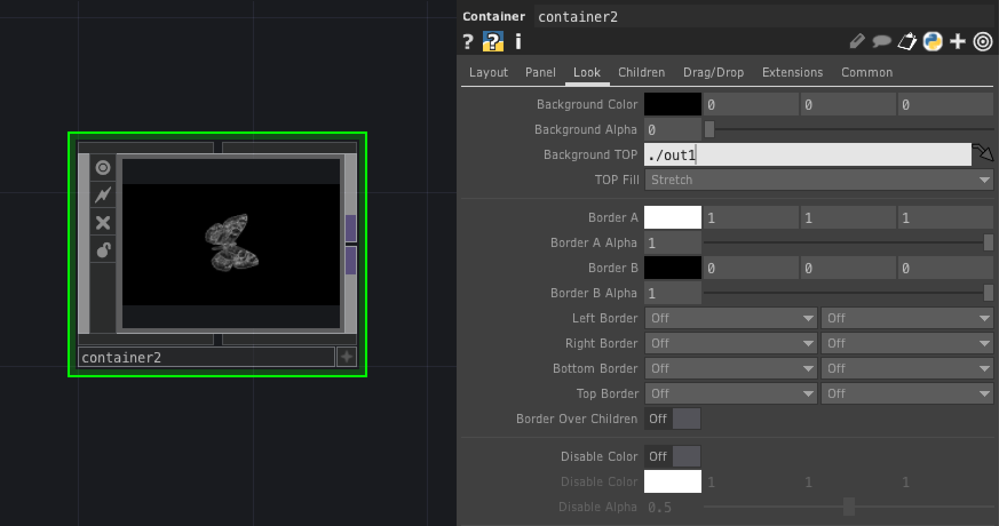
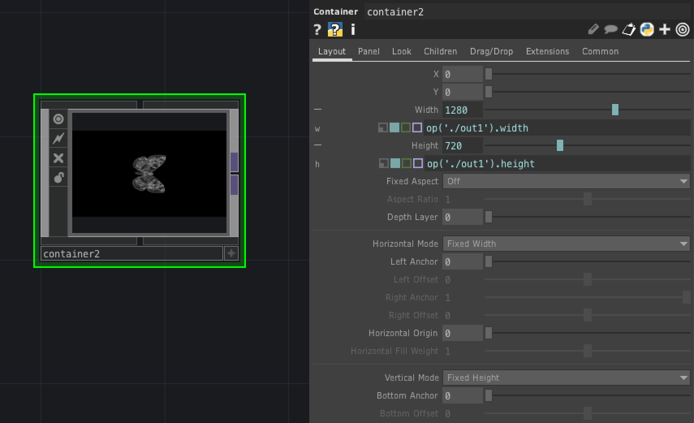

# COMP (Component)

プログラミングを構築する部品

---

&nbsp;
&nbsp;

## 公式リファレンス
[COMP - Components](https://docs.derivative.ca/Component)

&nbsp;
&nbsp;

# OP

&nbsp;
&nbsp;

## Base

パラメーターを持たない箱。プロジェクトの格納に使う

&nbsp;
&nbsp;

## Button
ボタン
&nbsp;
&nbsp;

#### Button Type
- `Toggle Down` On/Off(0-1)切り替え
- `Momentary` 押しているときだけ On(1)

&nbsp;
&nbsp;

## Camera

3Dオブジェクト用のカメラ

&nbsp;
&nbsp;

## Container

インターフェイスを作るためのパネルコンポーネント

`Look`の`Background TOP`から中身の最終表示OPを指定する

`Layout`の`Width` `Height`で中身の最終表示OPのサイズを指定する

&nbsp;
&nbsp;

## Geometory

SOPの3Dオブジェクトを格納する

&nbsp;
&nbsp;

## Light

3Dオブジェクト用のライト

&nbsp;
&nbsp;

## Slider
スライダー

&nbsp;
&nbsp;

